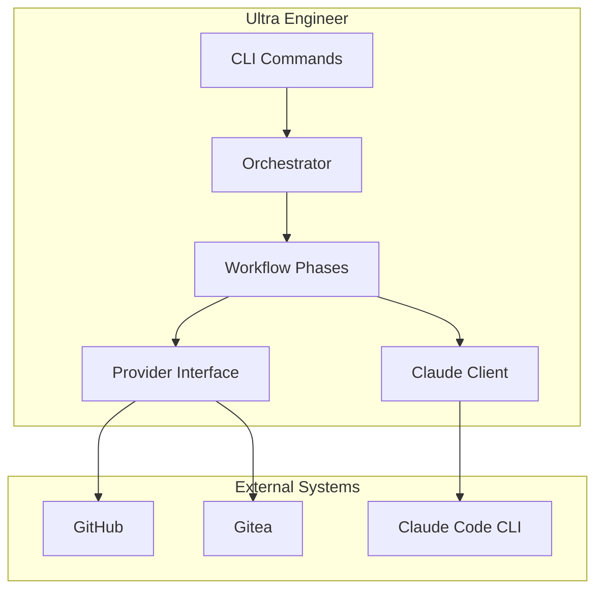
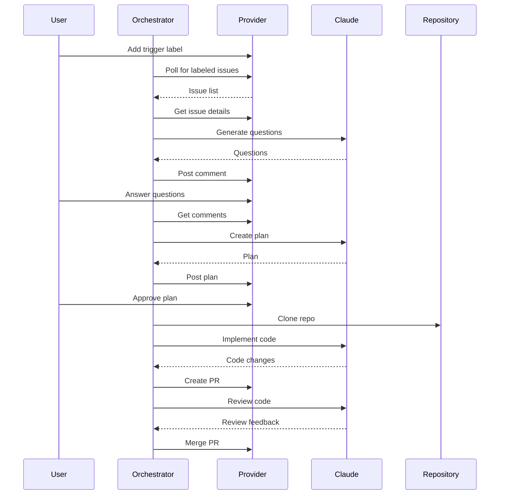
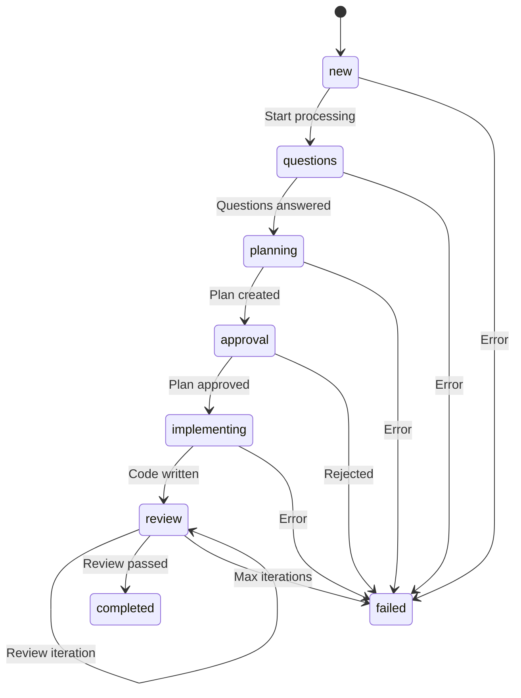
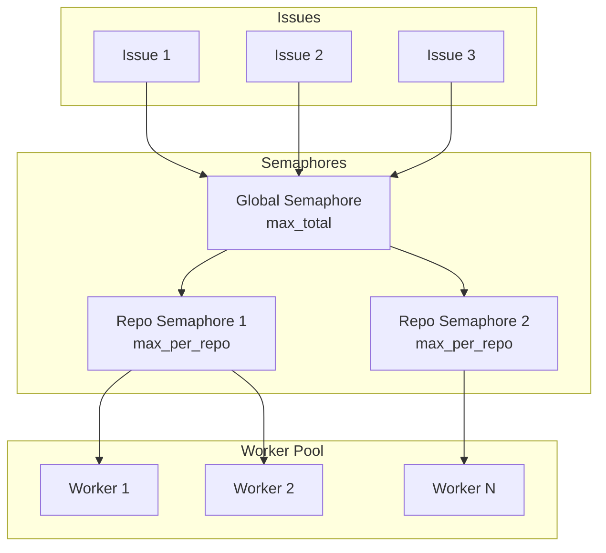
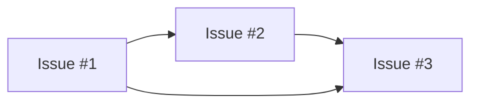

# Architecture Overview

Ultra Engineer is an orchestration system that automates GitHub/Gitea issue implementation using Claude Code CLI.

## System Design

## Component Overview

### CLI Layer (`cmd/ultra-engineer/`)

Entry points for user interaction:

- **daemon**: Continuous polling mode for automated processing
- **run**: Single issue processing for manual/testing use
- **status**: Display current processing status
- **abort**: Stop processing and mark as failed
- **version**: Show version information

### Orchestrator (`internal/orchestrator/`)

Core coordination logic:

- **orchestrator.go**: Main orchestration loop
- **polling.go**: Issue discovery and polling
- **concurrent.go**: Worker pool for parallel processing
- **dependency.go**: Dependency detection and cycle checking

### Workflow (`internal/workflow/`)

Phase-specific implementations:

- **qa.go**: Q&A phase for gathering requirements
- **planning.go**: Implementation planning
- **implementation.go**: Code writing
- **review.go**: Review cycles
- **pr.go**: Pull request management
- **ci.go**: CI status monitoring

### Providers (`internal/providers/`)

Git platform abstraction:

- **provider.go**: Interface definitions
- **github.go**: GitHub implementation (via `gh` CLI)
- **gitea.go**: Gitea implementation (HTTP API)
- **mock.go**: Testing mock

### State (`internal/state/`)

Workflow state management:

- Phase tracking via labels
- State persistence in HTML comments
- State serialization/deserialization

### Claude (`internal/claude/`)

Claude Code CLI integration:

- CLI invocation with appropriate flags
- Prompt templates for each phase
- Output parsing

## Data Flow

### Issue Processing Flow

## State Machine

Issues progress through phases tracked via labels:

## Sandbox Management

Each issue is processed in an isolated working directory:

1. **Clone**: Repository cloned to temporary directory
2. **Branch**: New branch created for changes
3. **Work**: Claude operates within sandbox
4. **Push**: Changes pushed to remote
5. **Cleanup**: Sandbox removed after completion

This isolation prevents:
- Concurrent issues interfering with each other
- Local state pollution
- File conflicts

## Claude CLI Integration

Ultra Engineer invokes Claude Code CLI with specific configurations per phase:

| Phase | Tools Allowed | Purpose |
|-------|---------------|---------|
| Q&A | Read-only | Generate clarifying questions |
| Planning | Read-only | Create implementation plan |
| Implementation | Full access | Write code |
| Review | Full access | Review and refine |

Prompts are tailored for each phase (see `internal/claude/prompts.go`).

## Concurrency Model

Workers acquire semaphores before processing:
1. Global semaphore (enforces `max_total`)
2. Per-repo semaphore (enforces `max_per_repo`)

## Dependency Handling

Dependencies are detected from issue text and tracked in state:

- Issues wait for dependencies to complete
- Cycles are detected and fail immediately
- Override with `no-dependencies` label

## Error Handling

Errors are handled at multiple levels:

1. **Transient errors**: Retried with exponential backoff
2. **Rate limits**: Longer retry interval
3. **Permanent errors**: Issue marked as failed
4. **CI failures**: Automated fix attempts (if enabled)

See [ADRs](adr/) for detailed architectural decisions.
